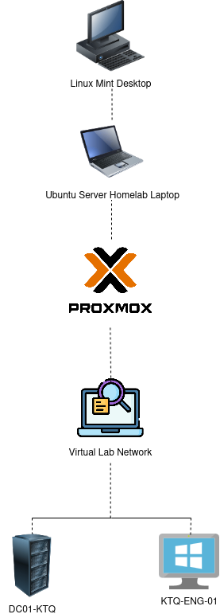

# Network Design
**Version:** 1.0

**Status:** Planning Complete

**Last Updated:** July 2026

## Overview
This document describes the network design for the Enterprise Active Directory Help Desk Lab.

It outlines the architecture, major infrastructure components, IP addressing scheme, naming conventions, and design decisions used throughout the project. The goal is to establish a clear foundation before deploying any Windows Server services.

## Objectives
The Version 1 environment was designed to:

- Deploy a Windows Server domain controller
- Configure an isolated lab network
- Validate communication between server and client
- Prepare for Active Directory deployment
- Provide a foundation for future expansion

## Version 1 Architecture

Version 1 of the lab is built on a dedicated Ubuntu Server virtualization host running Proxmox. The virtualization host contains two virtual machines:

- DC01-KTQ, a Windows Server 2022 domain controller
- KTQ-ENG-01, a Windows 11 Enterprise workstation

Both virtual machines communicate over an isolated virtual lab network to simulate an enterprise environment while remaining separate from the home network.

A Linux Mint desktop serves as the management workstation used to administer the homelab, maintain documentation, and manage the GitHub repository.

## Components

### Linux Mint Management Workstation
The Linux Mint desktop serves as the primary management workstation for the project. It is not part of the simulated enterprise environment, but instead provides the tools needed to manage and document the lab.

Responsibilities include:
- Create and maintain project documentation
- Manage the Git repository
- Create network diagrams
- Connect remotely to the Ubuntu Server virtualization host
- Push project updates to GitHub

### Ubuntu Server Virtualization Host
A dedicated laptop running Ubuntu Server serves as the virtualization host for the lab environment. 

Responsibilities include: 
- Run Proxmox
- Host all Windows virtual machines
- Provide compute resources for the Active Directory Lab
- Maintain the isolated virtual network

Separating the virtualization host from the management workstation more closely mirrors enterprise environments, where virtualization infrastructure is typically managed from dedicated administrative workstations.

### Proxmox Virtual Environment (VE)
Proxmox VE serves as the hypervisor for the project.

Primary responsibilities include:

- Hosting Windows Server and Windows 11 virtual machines
- Providing isolated virtual networking
- Supporting snapshots during major deployment milestones
- Managing virtual machine resources and storage

### Virtual Lab Network
The virtual lab network provides an isolated environment where all Windows virtual machines communicate with one another. 

Using an isolated network prevents the lab from interfering with the home network while allowing enterprise services such as Active Directory, DNS, and DHCP to function as they would in a production environment. 

### DC01-KTQ
DC01-KTQ is the first Windows Server virtual machine and serves as the central infrastructure server for the environment.

Planned Responsibilities: 
- Active Directory Domain Services
- DNS 
- DHCP
- Domain authentication 
- Centralized directory management

### KTQ-ENG-01
KTQ-ENG-01 is the first Windows 11 Enterprise client workstation. 

It represents an Engineering department employee workstation and will be used to:
- Join the Active Directory domain
- Authenticate using domain accounts
- Validate DNS and DHCP functionality
- Test Group Policy deployment
- Simulate common help desk scenarios

## IP Addressing Plan
| Device | Address | Assignment |
|---------|----------|------------|
| Network | 10.10.10.0/24 | Private Network |
| Gateway | 10.10.10.1 | Reserved |
| DC01-KTQ | 10.10.10.10 | Static |
| FS01-KTQ | 10.10.10.20 | Static |
| KTQ-ENG-01 | DHCP | Dynamic |
| DHCP Scope | 10.10.10.100 - 10.10.10.199 | Dynamic |

Servers are assigned static IP addresses to ensure critical infrastructure services remain consistently available. Client workstations receive IP addresses dynamically through DHCP.

## Naming Conventions
A consistent naming convention improves readability, administration, and troubleshooting as the environment grows.

### Servers
Format: ROLE##-KTQ

Examples:
- DC01-KTQ
- FS01-KTQ
- ADMIN01-KTQ

### Workstations
Format: KTQ-DEPARTMENT-##

Examples:
- KTQ-ENG-01
- KTQ-ACC-01
- KTQ-HR-01

### Security Groups
Format: GG_Department_Name

Examples:
- GG_Engineering_Users
- GG_Accounting_Users
- GG_IT_Users

Using predictable naming conventions makes systems easier to identify and aligns with common enterprise administration practices.
## Design Decisions

Several design decisions were made before deploying the environment.

### Dedicated Virtualization Host

A dedicated Ubuntu Server laptop was selected as the virtualization host while a separate Linux Mint desktop is used for management and documentation. This separates infrastructure from administration and more closely resembles enterprise environments.

### Isolated Virtual Network

The Windows environment is deployed on an isolated virtual network to prevent interference with the home network while allowing enterprise services to operate normally.

### Incremental Deployment

The environment will be built in stages, beginning with one domain controller and one client workstation. Additional servers, services, and workstations will be added only after each deployment milestone has been successfully tested and documented.

### Documentation First

Every major configuration task will be documented before moving to the next phase. This provides a complete deployment history and demonstrates the reasoning behind each technical decision.

## Future Expansion
Future versions of the environment will include:

- Additional Windows 11 client workstations
- File Server (FS01-KTQ)
- Print Server
- Administrator workstation
- Organizational Units (OUs)
- Security Groups
- Group Policy Objects
- Department shared folders
- PowerShell automation
- Simulated help desk ticket scenarios

The long term goal is to create a fully documented enterprise Active Directory environment capable of supporting realistic administrative and troubleshooting tasks.
## Lessons Learned
Planning the environment before deployment established a clear roadmap for the remainder of the project. Defining the network architecture, naming conventions, and IP addressing scheme early provides a consistent foundation that will reduce configuration errors and simplify future expansion as additional services are introduced.

This planning phase also reinforced the importance of documenting design decisions before implementation, making the project easier to maintain and understand over time.