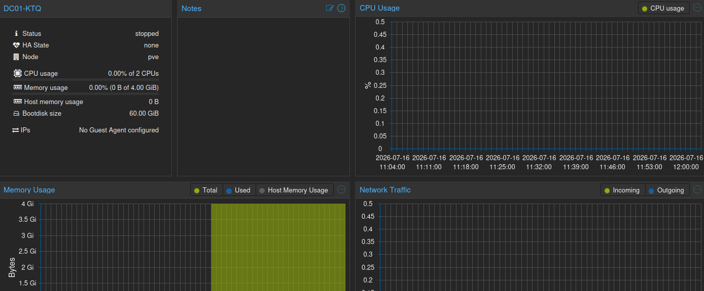
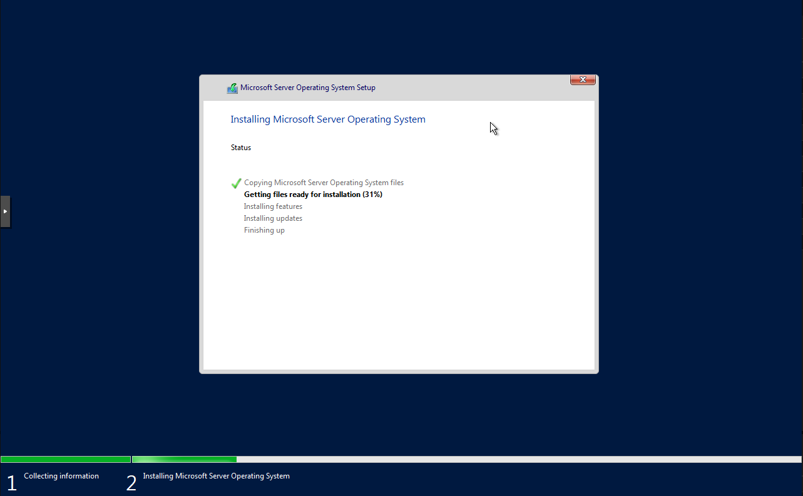
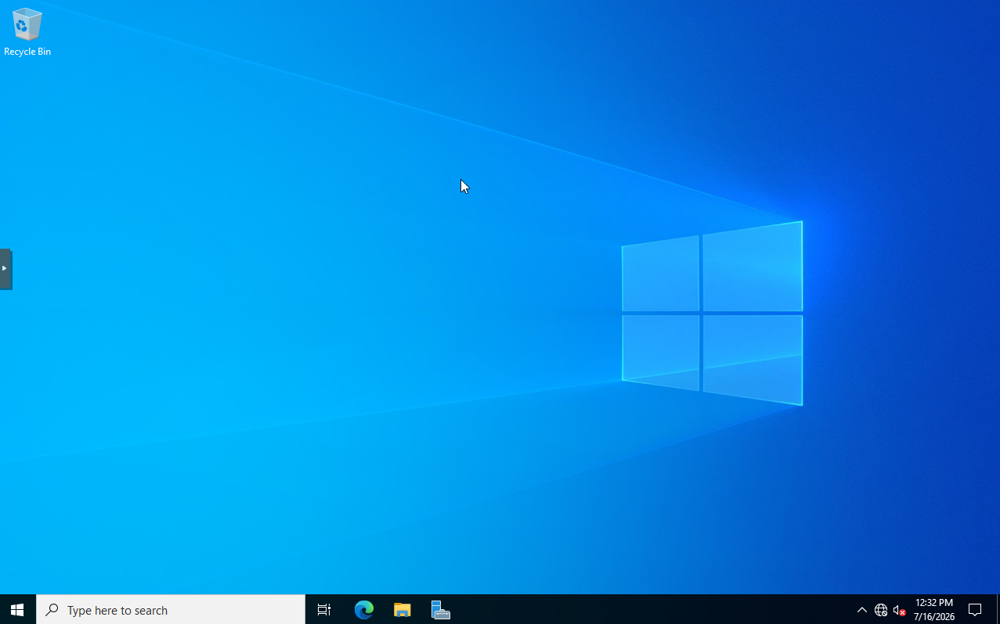
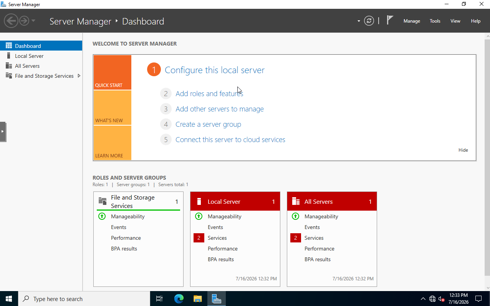
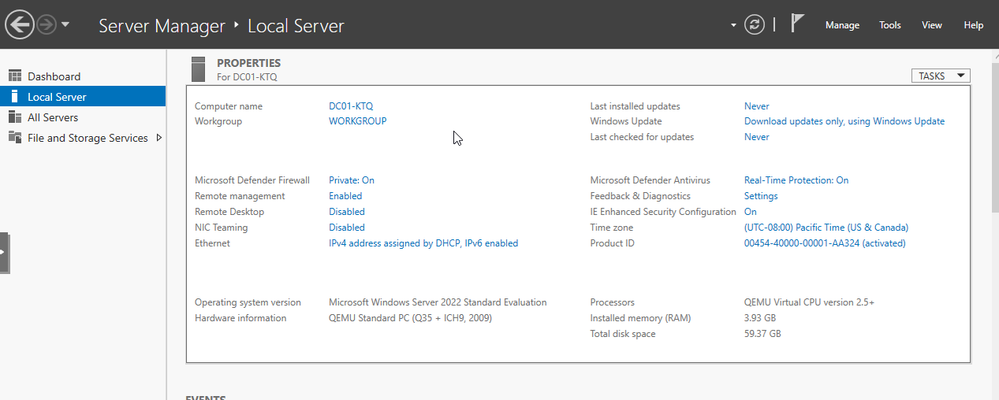

# Domain Controller Deployment

## Objective

The goal of this phase was to deploy the first Windows Server virtual machine for the Kinetiq Technologies environment. This server will serve as the primary Domain Controller and provide the foundation for Active Directory, DNS, DHCP, and the other infrastructure services that will be added throughout the project.

---

## Environment

| Component | Value |
|-----------|-------|
| Server Name | DC01-KTQ |
| Operating System | Windows Server 2022 Standard Evaluation |
| Hypervisor | Proxmox VE |
| Firmware | UEFI (OVMF) |
| Machine Type | q35 |

---

## Virtual Machine Configuration

Before installing Windows Server, I created a virtual machine in Proxmox and allocated resources appropriate for a small Active Directory environment.

| Component | Configuration |
|-----------|---------------|
| Hypervisor | Proxmox VE |
| Firmware | UEFI (OVMF) |
| Machine Type | q35 |
| TPM | TPM 2.0 |
| Disk Controller | VirtIO SCSI |
| Disk Size | 60 GB |
| CPU | 2 vCPUs |
| Memory | 4 GB |
| Network Adapter | VirtIO |
| Network Bridge | vmbr0 |

---

## Configuration

The virtual machine was created in Proxmox using UEFI firmware, a VirtIO SCSI disk controller, and a VirtIO network adapter. These settings provide good compatibility with Windows Server while matching modern virtualization practices.

A 60 GB virtual disk, 2 vCPUs, and 4 GB of memory were allocated to provide enough resources for a domain controller without consuming unnecessary host resources.

Windows Server 2022 Standard Evaluation was then installed on the virtual machine.

After the installation completed, I signed in using the local Administrator account to perform the initial server configuration.

Server Manager was used as the starting point for the remaining configuration tasks.

The server was then renamed from the default Windows hostname to **DC01-KTQ** to match the naming convention established during the planning phase.

Renaming the server before installing Active Directory helps avoid additional configuration changes after the server has been promoted to a domain controller.

---

## Design Decisions

Several decisions were made during the deployment to keep the environment simple while leaving room for future expansion.

### UEFI Firmware

UEFI was selected because it reflects modern server deployments and supports features such as Secure Boot.

### Virtual Hardware

A domain controller has relatively light resource requirements in a homelab environment. Allocating 2 vCPUs and 4 GB of memory provides enough performance while leaving capacity available for additional virtual machines.

### Storage

A 60 GB virtual disk provides sufficient space for Windows Server, Active Directory, DNS, DHCP, logs, and future configuration changes.

### Network Bridge

The server was initially connected to **vmbr0** so it could access the internet during installation and receive Windows updates. The lab network will be migrated to a dedicated isolated virtual network in a later phase.

---

## Verification

The following checks were completed before moving on to the next phase:

- Windows Server installed successfully.
- The server booted without errors.
- Server Manager opened normally after login.
- The hostname was successfully changed to **DC01-KTQ**.
- The server rebooted successfully after the rename.

These checks confirmed that the server was ready for Active Directory installation.

---

## Lessons Learned

This phase gave me a better understanding of how much planning goes into deploying a server before any services are installed. Choosing the virtual hardware, naming the server correctly, and verifying the operating system all help avoid unnecessary changes later in the deployment.

I also became more familiar with the initial Windows Server setup process and the role Server Manager plays in managing server features and roles.

---

## Next Steps

With the base server deployed and configured, the next phase will focus on installing the Active Directory Domain Services role and promoting **DC01-KTQ** to the first domain controller in the Kinetiq Technologies environment.