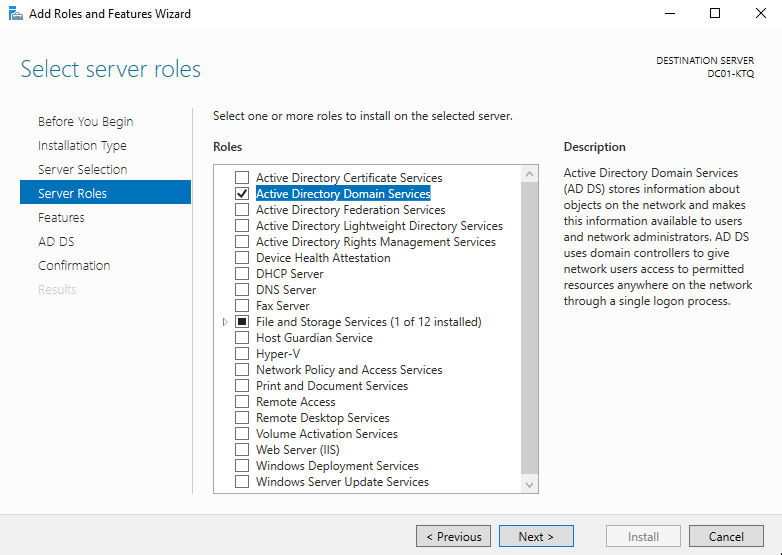
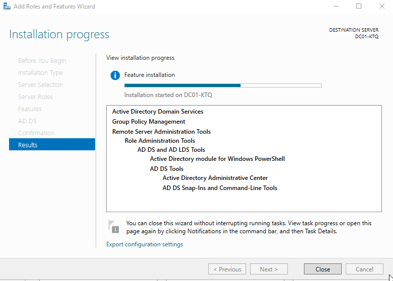
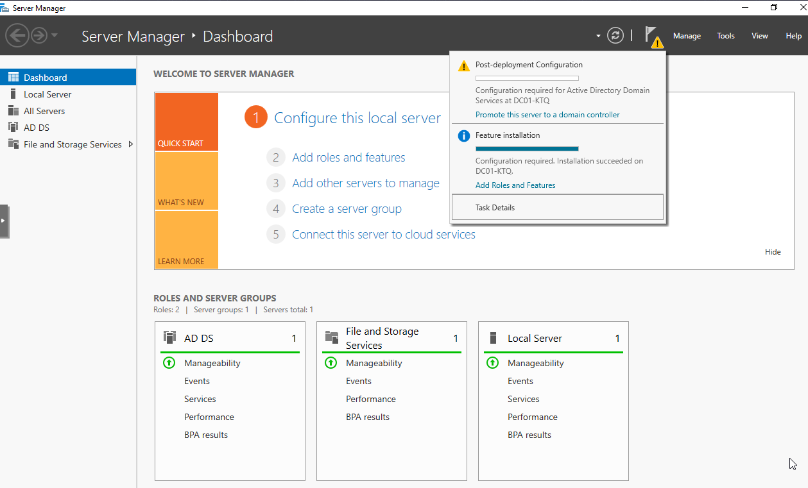
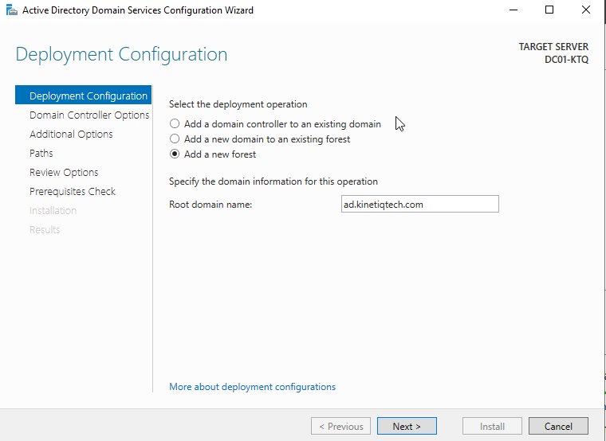
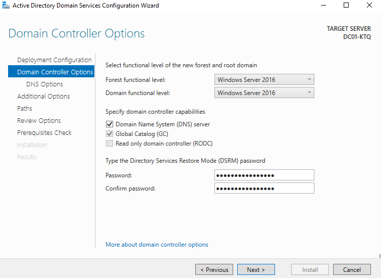
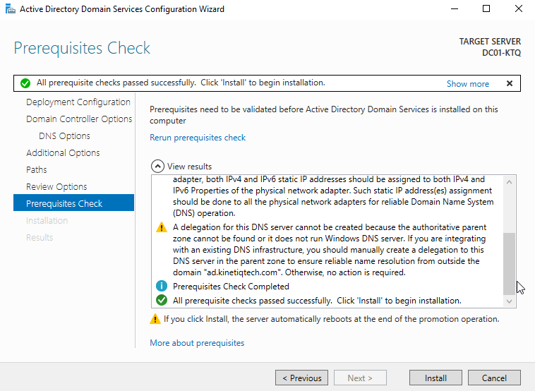
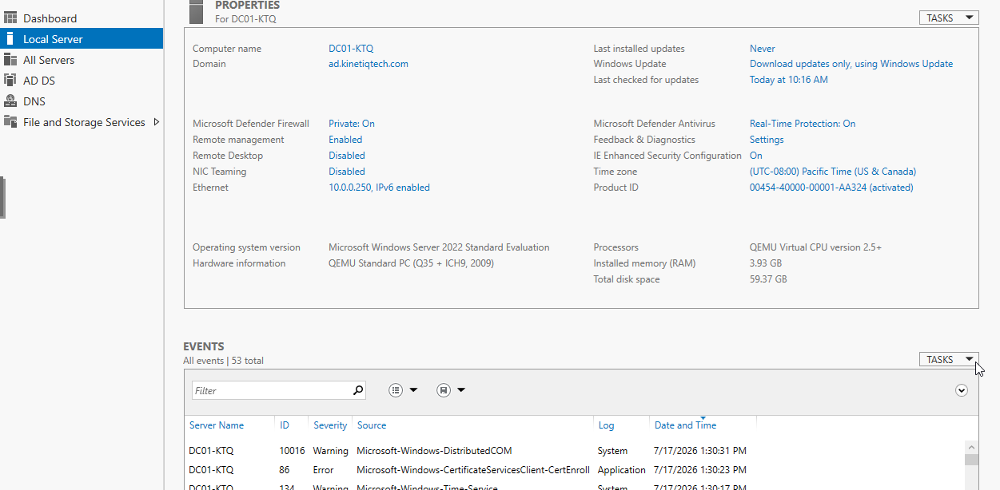
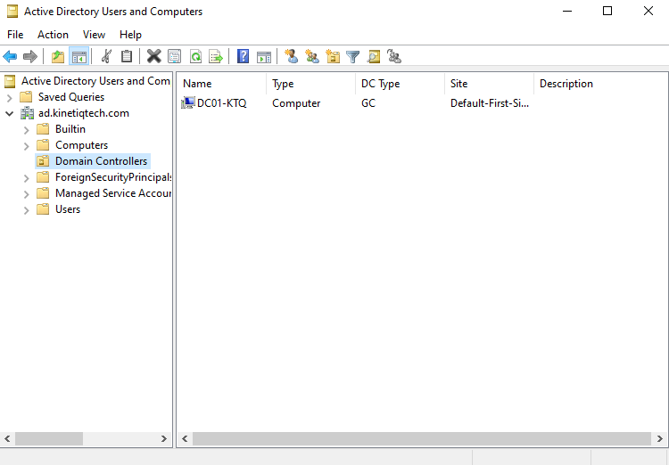
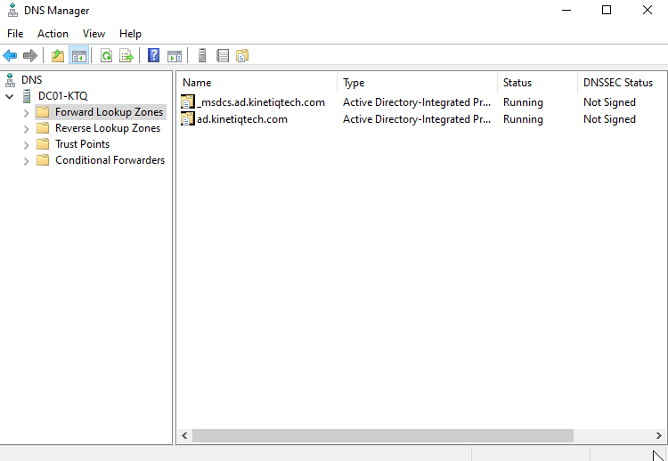

# Active Directory Installation

## Objective

The goal of this phase was to promote `DC01-KTQ` to the first Domain Controller for the Kinetiq Technologies environment by installing Active Directory Domain Services (AD DS) and creating a new Active Directory forest.

This phase also installs the DNS Server role, which Active Directory depends on for locating domain resources and authenticating users.

---

## Environment

| Setting | Value |
|---------|-------|
| Server Name | DC01-KTQ |
| Operating System | Windows Server 2022 Standard Evaluation |
| Hypervisor | Proxmox VE |
| Domain | ad.kinetiqtech.com |
| NetBIOS Name | KINETIQ |
| Temporary IPv4 Address | 10.0.0.250 |

---

## Installing the Active Directory Domain Services Role

The Active Directory Domain Services role was installed through the **Add Roles and Features Wizard** in Server Manager.

Installing this role adds the software required for Windows Server to function as a Domain Controller. However, installing the role alone does not create an Active Directory environment. The server must still be promoted to a Domain Controller by either creating a new forest or joining an existing domain.

After confirming the installation settings, Windows Server installed the required Active Directory services.

---

## Post-Deployment Configuration

Once the installation completed, Server Manager displayed a post-deployment notification indicating that additional configuration was required.

Selecting **Promote this server to a domain controller** launched the Active Directory Domain Services Configuration Wizard, which was used to create the first Active Directory forest for the environment.

---

## Creating the Active Directory Forest

Since this is the first Domain Controller in the environment, a new Active Directory forest was created.

The root domain name chosen for the environment is:

`ad.kinetiqtech.com`

Using a dedicated Active Directory domain separates the internal enterprise environment from any future public-facing services while providing a centralized location for managing users, computers, groups, and security policies.

---

## Domain Controller Options

During the promotion process, the following configuration options were selected:

- Forest Functional Level: Windows Server 2016
- Domain Functional Level: Windows Server 2016
- DNS Server enabled
- Global Catalog enabled
- Read-Only Domain Controller disabled
- Directory Services Restore Mode (DSRM) password configured

The DNS Server role was installed because Active Directory depends on DNS to locate Domain Controllers and other directory services.

The Global Catalog was enabled because this is the first Domain Controller in the forest and it stores information about every object in the directory.

The Read-Only Domain Controller option remained disabled because the first Domain Controller must be fully writable.

The DSRM password was configured to provide administrative access if Active Directory ever needs to be repaired or restored.

---

## Prerequisites Check

Before promoting the server, Windows Server performed a series of prerequisite checks to verify that the environment was properly configured.

The validation completed successfully with only expected warnings for a new forest deployment.

---

## Domain Controller Promotion

After the prerequisite checks completed successfully, the promotion process began.

During this process, Windows Server:

- Created the Active Directory forest
- Created the `ad.kinetiqtech.com` domain
- Installed and configured the DNS Server role
- Created the Active Directory database (NTDS)
- Created the SYSVOL shared folder
- Promoted `DC01-KTQ` to the first Domain Controller

The server automatically restarted after the promotion completed.

Following the restart, `DC01-KTQ` became the first Domain Controller for the Kinetiq Technologies environment.

---

## Verification

After promotion, several verification steps were performed to confirm that Active Directory and DNS were functioning correctly.

### Active Directory Users and Computers

The `ad.kinetiqtech.com` domain was successfully created.

The **Domain Controllers** organizational unit contained the newly promoted server:

- DC01-KTQ

This confirmed that the server had been successfully promoted to a Domain Controller.

### DNS Manager

The DNS Server role was successfully configured during promotion.

The following forward lookup zones were automatically created:

- ad.kinetiqtech.com
- _msdcs.ad.kinetiqtech.com

These zones allow client computers to locate Domain Controllers and other Active Directory services through DNS.

---

## Lessons Learned

This phase helped me understand that installing the Active Directory Domain Services role does not immediately create a Domain Controller. The server must first be promoted by creating a new forest or joining an existing Active Directory domain.

I also learned that Active Directory depends heavily on DNS. During promotion, Windows automatically installed and configured the DNS Server role because client computers use DNS to locate Domain Controllers and authenticate users.

Finally, I learned that a forest is the highest-level structure in Active Directory. The forest contains one or more domains and serves as the foundation for organizing users, computers, groups, and security policies throughout an enterprise environment.

---

## Next Steps

With the first Domain Controller successfully deployed, the next phase of the project will focus on designing the Active Directory structure for Kinetiq Technologies.

This will include:

- Creating Organizational Units (OUs)
- Creating department security groups
- Creating user accounts
- Creating computer accounts
- Preparing the environment for Group Policy deployment