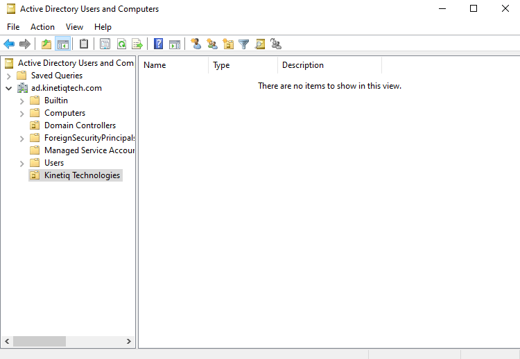
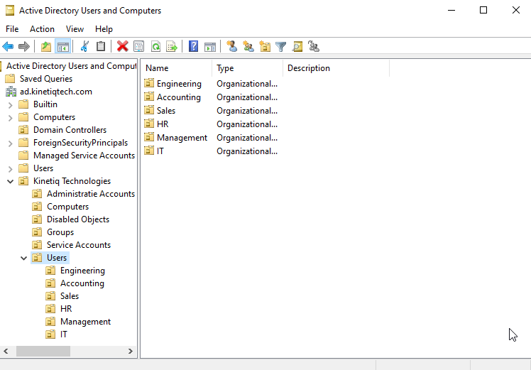
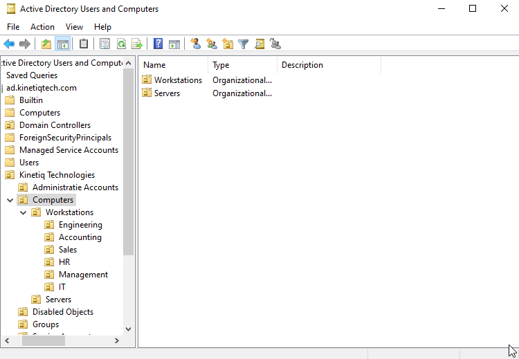
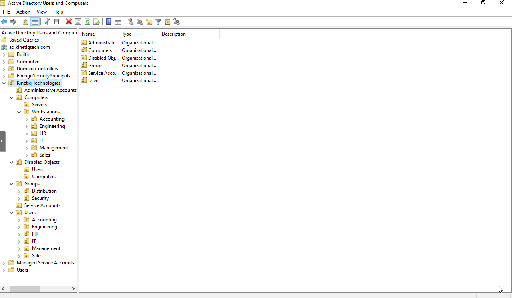

# Active Directory Organizational Unit Implementation
## Objective
The objective of this phase was to implement the Organizational Unit (OU) structure that was designed during the previous phase. 

Creating the OU hierarchy before adding users, computers, and groups provides a logical structure for managing Active Directory objects as the environment grows. It also prepares the domain for future Group Policy deployment, delegated administration, and resource management. 

## Configuration 
The Organization Unit structure was created using Active Directory Users and Computers on **DC01-KTQ**

A new top-level OU named **Kinetiq Technologies** was created directly under the **ad.kinetiqtech.com** domain. This OU serves as the root container for all custom Active Directory objects create for this lab. 

The option to protect each Organizational Unit from accidental deletion was left enabled during creation to follow recommended administrative practices. 

After creating the top level OU, the primary Organization Units were created. 

- Users
- Computers
- Groups
- Administrative Accounts
- Service Accounts
- Disabled Objects

These OUs separate Active Directory Objects by their purpose rather than placing everything inside the default containers created during domain installation. 

The initial Kinetiq Technologies OU is shown below. 

### User Organizational Units

Department specific Organizational Units were created under the **Users** OU. 

The following departments were created: 
- Engineering
- Accounting
- Sales
- Human Resources
- Management 
- Information Technology

Separating users by department will make it easier to organize employee accounts and apply department specific Group Policy Objects in future phases. 

The completed user OU structure is shown below. 

### Computer Organizational Units
The Computers OU was divided into separate Organizational Units for workstations and servers. 

A Workstations OU was created for employee computers, while a Servers OU was created for future member servers such as file and print servers. 

Department specific Organization Units were also created beneath Workstations to match the user structure. 

This separation allows workstation policies to be managed independently from server policies. 

The completed computer structure is shown below. 

### Group Organizational Units
Separate Organizational Units were created for security groups and distribution groups. 

Although no groups have been created yet, preparing the structure now will make future administration more consistent and organized. 

### Administrative and Service Account Organizational Units
Dedicated Organizational Units were created for administrative accounts and service accounts.

Adminstrative accounts will eventually contain privivileged user accounts used for system adminstration. 

Service accounts will be used for applications, scheduled tasks, and Windows services that required dedicated credentials. 

Separating these accounts from standard employee accounts follow common enterprise Active Directory practices. 

### Disabled Object Organizational Units
Separate Organizational Units were created for disabled user accounts and disabled computer accounts. 

These OUs provide a temporary location for inactive objects before they are permanently removed from Active Directory. 

This approach helps keep active objects organized while maintaining a location for accounts that may still need to be retained for administrative purposes. 

### Completed Organizational Unit Hierarchy
After all Organizational Units were created, the completed hierarchy was reviewed to confirm it matched the design completed during the previous phase. 

### Verification 
The completed Organizational Unit hierarchy was verified using Active Directory Users and Computers. 

The following item were confirmed: 
- The Kinetiq Technologies top level OU was created successfully. 
- All primary Organizational Units were present. 
- Department specific Organization Units were created beneath the appropriate parents OUs. 
- The workstation hierarchy matched the planned design. 
- **DC01-KTQ** remained inside the default Domain Controllers Organizational Unit. 
- No custom objects were created inside the default Users or Computers containers. 

The completed hierarchy matched the design documented during the previous phase. 

### Lessons Learned
Implementing the Organizational Unit hierarchy reinforced the importance of planning ACtive Directory before creating objects. 

I also gained a better understanding of the difference between built in Active directory containers and Organizational Units. Although they appear similar within Active Directory Users and Computers, Organizational Units provide additional management capabilities such as Group Policy targeting adn delegated administration. 

Separating users, workstations, servers, administrative accounts, service accounts, and disabled objects creates a structure that will be easier to manage as the environment becomes more complex. 

## Next Steps
The next phase will focus on designing the identity management strategy for Kinetiq Technologies. 

This includes establishing naming conventions for users, computers, administrative accounts, services accounts, and security groups before creating any Active Directory objects. 