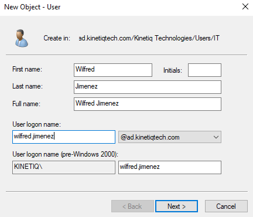
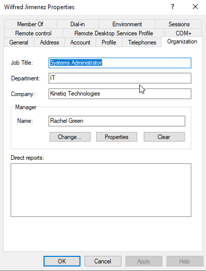
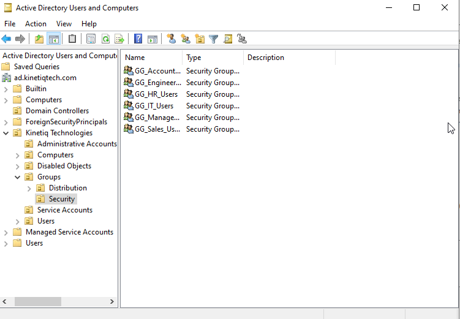
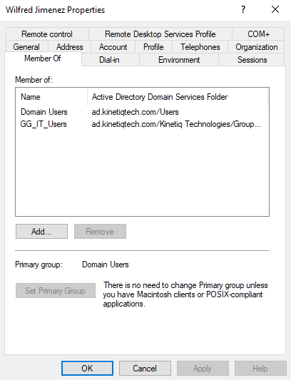
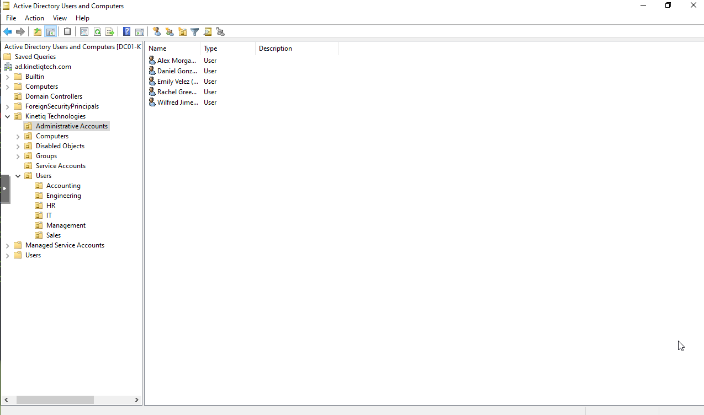
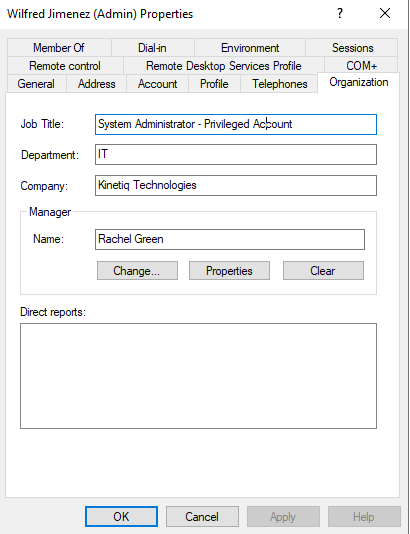
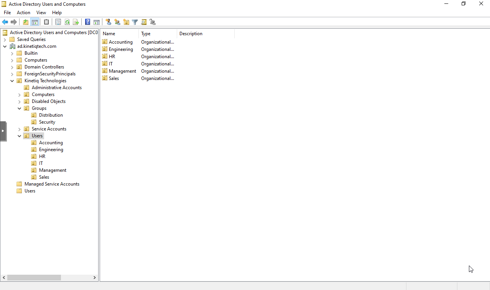

# User and Group Provisioning
## Objective 
The objective of this phase was to populate ACtive Directory with users, security groups, and administrative accounts for Kinetiq Technologies. 

Creating user accounts and organizing them into security groups establishes the foundation for authentication, and resource management throughout the domain. This structure will be used during future phases when configuring shared folders, Group Policy, printers, and other network resources. 

## Environment 
The Active Directory environment currently consists of: 

| Component | Configuration |
|---|---|
| Domain Controller | **DC01-KTQ** |
| Operating System | **Windows Server 2022 Standard Evaluation** |
| Active Directory Domain | **ad.kinetiqtech.com** |
| NetBIOS Domain Name | **KINETIQ** |
| Domain Functional Level | **Windows Server 2016** |
| Forest Functional Level | **Windows Server 2016** |

The Organizational Unit structure implemented during the previous phase was used to organize all users, groups, and administrative accounts. 

## Configuration
### User Account Provisioning
Employee accounts were created using Active Directory Users and Computers.

Each user account follow the established naming convention: 
```text
firstname.lastname 
```
The user logon name, display name, and Organizational Unit placement were configured during account creation. 

An example user account is shown below. 



A total of **40 employee accounts** wer created across the following departments:
- Management
- Information Technology
- Engineering
- Sales
- Accounting
- Human Resources

Each account was placed inside its corresponding departmental Organizational Unit to maintain a consistent Active Directory structure. 

### User Attributes
Additional user information was populated after each account was created.

The following attributes were configured where applicable:
- Job Title
- Department
- Company
- Manager
- Email Address

Populating these attributes makes Active Directory more useful for administration and provides additional information for future management tasks. 

An example of the configured user attributes is shown below. 



### Department Security Groups
Global security groups were created for each department:

The following groups were created:
```text
GG_Management_Users
GG_IT_Users
GG_Engineering_Users
GG_Sales_Users
GG_Accounting_Users
GG_HR_Users
```

These groups will later groups will later be assigned permissions to shared folders, printers, and other resources instead of assigning permissions directly to individual user accounts. 

The completed department security groups are shown below. 


### Group Membership
Each employee account was added to the security group associated with its department. 

For example, IT employees were added to:
```text
GG_IT_Users
```

Managing permissions through security groups simplifies administration by allowing access to be controlled for an entire department rather than individual users. 

A example group membership is shown below. 



### Administrative Accounts
Separate administrative accounts were created for Information Technology staff. 

Each administrative account followed the naming convention:

```text
adm.firstname.lastname
```

Example include:
```text
adm.wilfred.jimenez
adm.rachel.green
adm.emily.velez
```

Creating separate privileged accounts follows the principle of least privilege by separating administrative task from normal daily activities. 

The completed Administrative Accounts Organizational Unit is shown below. 



Administrative account properties were configured to clearly identify their privileged role within the environment. 



Administrative accounts were created without assigning elevated domain privileges. Permissions will be configured during a later phase as administrative responsibilities are defined. 

## Verification
The complete Active Directory environment was verified using Active Directory Users and Computers. 

The following items were confirmed:
- All 40 employee accounts were created successfully 
- Users were placed in the correct departmental Organizational Units. 
- Department security groups were created successfully. 
- Users were assigned to their corresponding department security groups. 
- User attributes were populated correctly. 
- Separate administrative accounts were created for Information Technology staff. 
- Administrative accounts remained separate from standard user accounts. 
- The Organizational Unit structure remained consistent after all objects were created. 

The completed environment is shown below. 



## Lessons Learned
Creating a large number of Active Directory objects reinforced the importance of establish naming standards before creating users and groups. 

I also gained a better understanding of how Organizational Units, user accounts, and security groups work together within Active Directory. Organizational Units organize objects for administration and Group Policy, while security groups provide a scalable way to assign permissions to shared resources. 

Creating separate administrative accounts also demonstrated the importance of limiting the use of privileged credentials during normal daily activities. 

## Next Steps
The next phase will expand the environment by deployed a member file server. 

Department security groups created during this phase will be used to control access to shared folders and other network resources using both share permissions and NFTS permissions. 