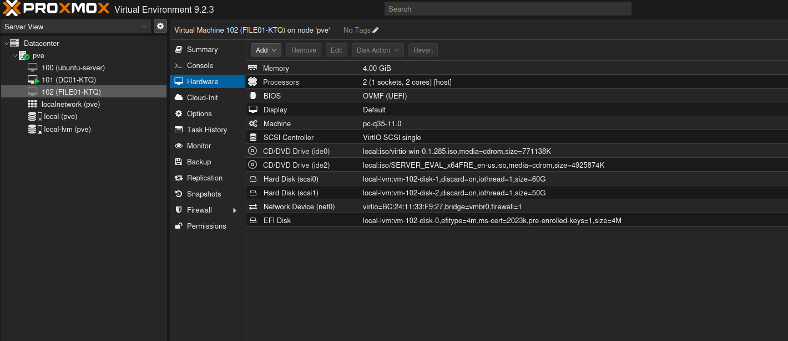
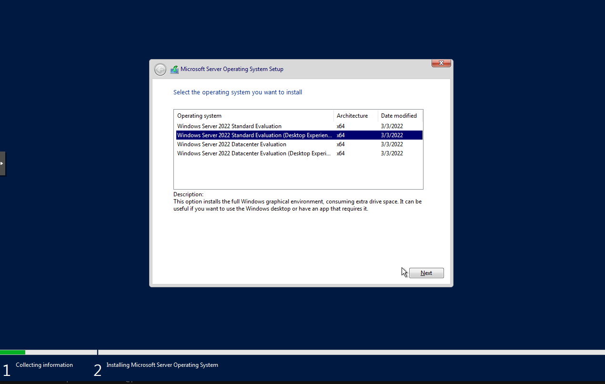
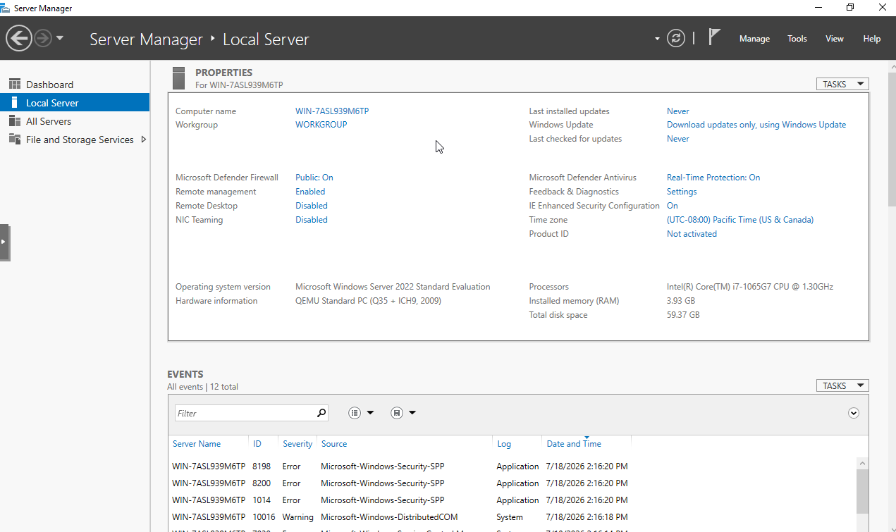
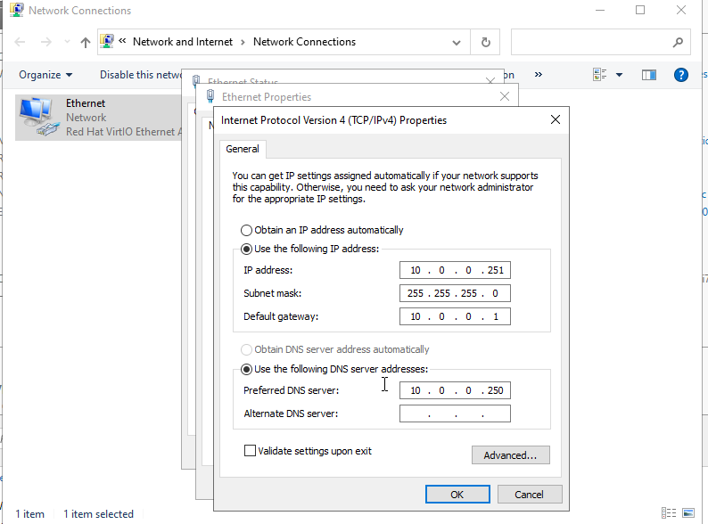
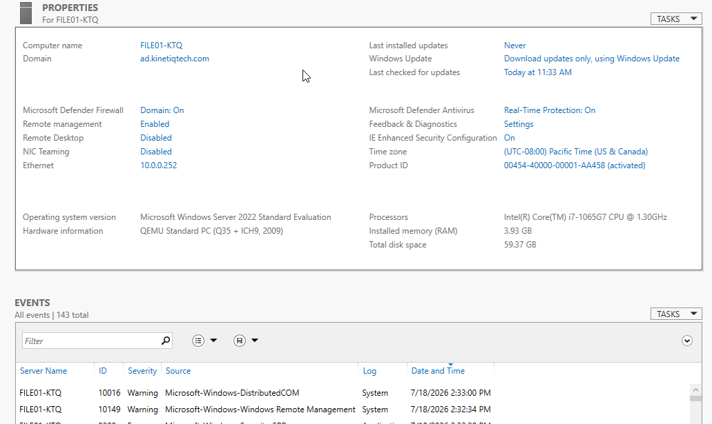
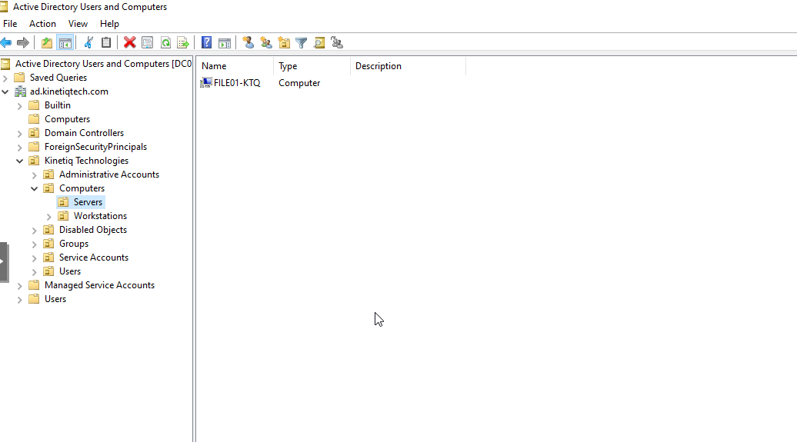
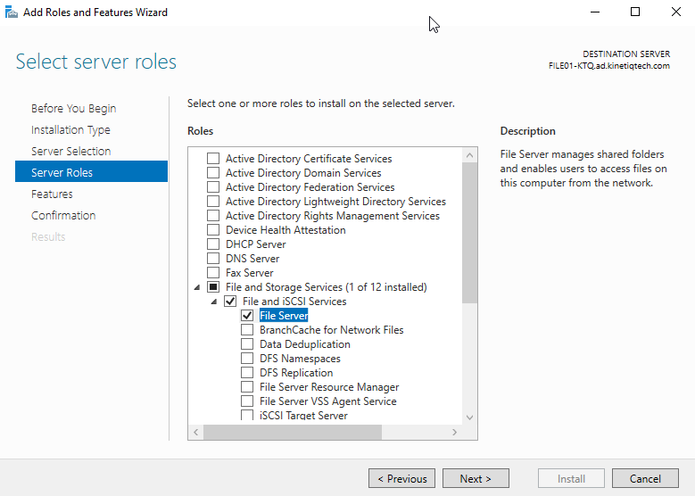
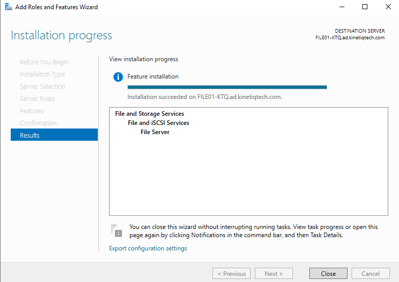
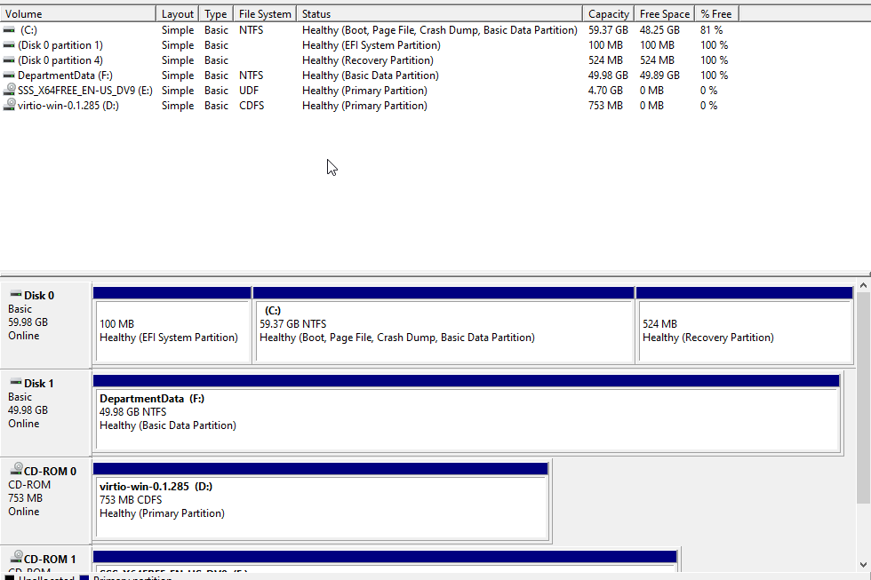
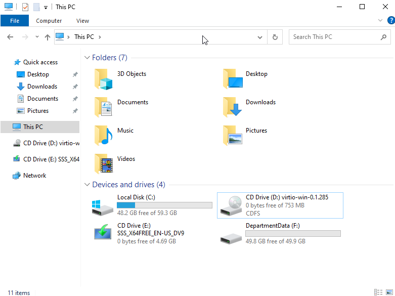

# 08 - Member File Server Deployment

## Objective

Deploy a dedicated Windows Server 2022 member server to host departmental file shares for the Kinetiq Technologies Active Directory environment.

The server was joined to the existing Active Directory domain, configured with a static IP address, and prepared with an additional data volume for future shared folders.


## Environment

| Component | Configuration |
|-----------|---------------|
| Hypervisor | Proxmox VE |
| Operating System | Windows Server 2022 Standard Evaluation (Desktop Experience) |
| Server Name | FILE01-KTQ |
| Domain | ad.kinetiqtech.com |
| IP Address | 10.0.0.252 |
| DNS Server | 10.0.0.250 |
| Server Role | File Server |


## Virtual Machine Configuration

A second Windows Server virtual machine was created in Proxmox to act as the dedicated file server.

The virtual machine was configured with:

- Windows Server 2022
- 2 vCPUs
- 4 GB RAM
- 60 GB operating system disk
- 50 GB secondary data disk
- VirtIO SCSI controller
- VirtIO network adapter
- UEFI firmware

The additional virtual disk was created specifically to store departmental file shares separately from the operating system.




## Windows Server Installation

Windows Server 2022 Standard Evaluation (Desktop Experience) was installed using the same installation procedure used for the Domain Controller.

Desktop Experience was selected to provide the graphical management tools required for this lab.




## Initial Server Configuration

After Windows installation completed, Server Manager was used to perform the initial configuration.

The server was prepared for integration into the existing Active Directory environment.




## Static Network Configuration

A static IPv4 configuration was assigned before joining the domain.

| Setting | Value |
|---------|-------|
| IP Address | 10.0.0.252 |
| Subnet Mask | 255.255.255.0 |
| Default Gateway | 10.0.0.1 |
| Preferred DNS | 10.0.0.250 |

Using the Domain Controller as the preferred DNS server allows the member server to locate Active Directory services and authenticate against the domain.

> **Note:** During deployment an IP address conflict was encountered using `10.0.0.251`. The server was reassigned to `10.0.0.252`, which became the permanent address used throughout the remainder of the project.



---

## Domain Join

The server was joined to the existing Active Directory domain:

```
ad.kinetiqtech.com
```

After the successful domain join and restart, the server became a member server within the Kinetiq Technologies environment.



---

## Organizational Unit Placement

After joining the domain, the computer object was moved from the default Computers container into the custom Organizational Unit structure.

Location:

```
Kinetiq Technologies
└── Computers
    └── Servers
        └── FILE01-KTQ
```

This organizational structure allows future Group Policy Objects to target member servers separately from workstations.




## File Server Role Installation

The File Server role was installed using the Add Roles and Features Wizard.

Only the core File Server role was installed, as additional services such as DFS and File Server Resource Manager will be configured separately if required later in the project.

### File Server Role Selection



### Installation Complete




## Data Volume Preparation

The secondary virtual disk was initialized using GPT and formatted with NTFS.

Configuration:

| Setting | Value |
|---------|-------|
| Partition Style | GPT |
| File System | NTFS |
| Volume Label | DepartmentData |
| Drive Letter | F: |

Separating shared data from the operating system simplifies future storage expansion, backup, and disaster recovery.




## Storage Verification

The completed storage configuration contains:

- Operating System Volume (C:)
- DepartmentData (F:)

The dedicated data volume will be used throughout the remaining phases of the project for departmental shared folders and NTFS permission management.



---

## Outcome

At the completion of this phase:

- FILE01-KTQ was successfully deployed.
- The server was joined to the Active Directory domain.
- The computer object was placed into the appropriate Organizational Unit.
- The File Server role was installed.
- A dedicated NTFS data volume was created for future departmental shares.

The environment now contains a dedicated Domain Controller and a dedicated File Server, closely matching the architecture commonly found in small and medium-sized enterprise Windows environments.